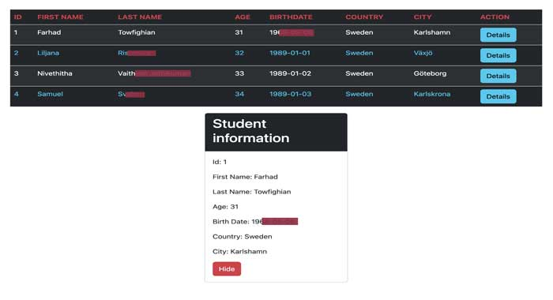

# First React workshop

## _**The Assignment:**_

### - Creating a dynamic Table with different Table-component that can be reusable.

### - Add a "Details" button that shows information of choosen studen in seperate card.

### - Use "arrow function", "props" and "usState" together with required JavaScript code.

### - For styling use Bootstrap together with your own CSS-file.

## _**The Result:**_

